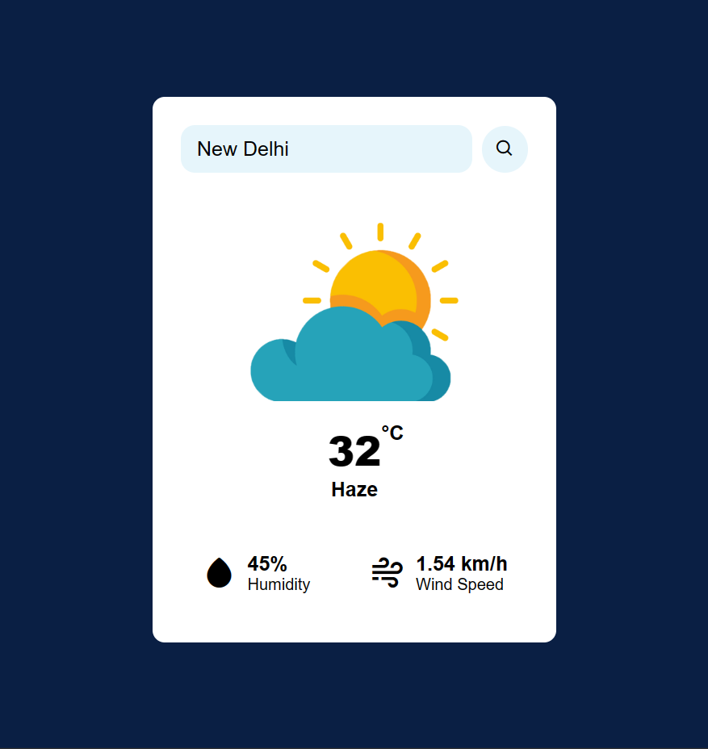

# Weather App Project

## Overview

This Weather App is a simple web application built using HTML, CSS, and JavaScript, designed to provide users with up-to-date weather information for any location around the world. It utilizes the OpenWeatherMap API to fetch weather data and displays it in a user-friendly interface. Additionally, open-source icons are used to represent different weather conditions.

## Demo

You can view a live demo of the project [here](https://weatherapp-project1.netlify.app/).

## Features

- **Location-based Weather**: Users can search for weather information for any location worldwide by entering the city name or ZIP code.

- **Current Weather**: The app provides current weather conditions, including temperature, humidity, and wind speed.

- **Weather Icons**: Weather conditions are represented with open-source icons to make it visually intuitive.

## Technologies Used

- **HTML**: The structure and content of the web page.

- **CSS**: Styling to make the app visually appealing and user-friendly.

- **JavaScript**: For interactivity and fetching data from the OpenWeatherMap API.

- **OpenWeatherMap API**: To obtain weather data.

- **Open Source Icons**: Used for representing different weather conditions.

## Getting Started

To run this project locally or deploy it on a web server, follow these steps:

1. Clone the repository to your local machine:

```
git clone https://github.com/rahulkumar-yadav/weather-app-project.git
```

2. Open the project folder in your code editor.

3. Replace the placeholder API key in the JavaScript file with your own OpenWeatherMap API key. You can obtain one by signing up on the OpenWeatherMap website.

4. Launch the app by opening the `index.html` file in a web browser.

## Usage

1. Enter the name of the city in the search bar.

2. Click the "Search" button to fetch the weather data.

3. The current weather conditions will be displayed on the screen.

4. Explore and enjoy the weather information for the selected location.

## Screenshots



## Credits

- **OpenWeatherMap API**: Weather data source.

- **Open Source Icons**: Used for weather condition icons.

## Feedback and Issues

If you encounter any issues with the Weather App or have suggestions for improvements, please [open an issue](https://github.com/rahulkumar-yadav/weather-app-project/issues) on the GitHub repository.

Thank you for checking out my project!
